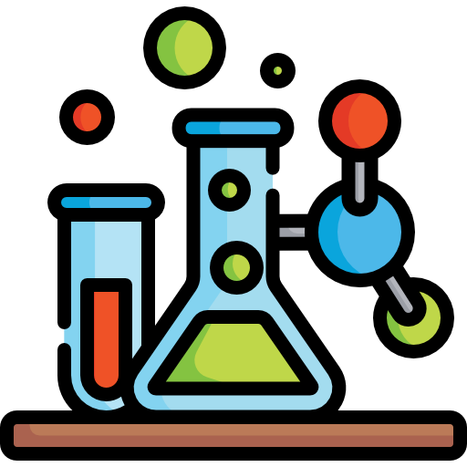

# Catalyst Engine

## Features
- Experiment and learn about chemistry.
- Interactive periodic table of elements.
- Computational chemistry.
- Machine learning based on chemical properties.
- Create an account:
  - Save flash cards.
  - Test your knowledge with an auto-generated quiz.

## Services
### [Spring Boot Java 25](services/backend-java/README.md)
- The backend for frontend (BFF) "brains" of the system.
- Package organization is inspired by [onion architecture](https://jeffreypalermo.com/2008/07/the-onion-architecture-part-1/).

### [FastAPI Python 3.14](services/worker-python/README.md)
- [RDKit](https://www.rdkit.org/) worker service.

### [Angular Frontend](https://github.com/calebd-anderson/open-chemistry-lab-frontend)
- The presentation layer with [Angular](https://angular.dev/).
- [D3.js](https://d3js.org/).

## Credits
- The [PubChem API](https://pubchem.ncbi.nlm.nih.gov/), public chemistry data service.
- Thanks to the online tutorial from [Get Arrays](https://www.getarrays.io/).
- [RoboHash](https://robohash.org/), temporary profile image generator.
- [Some chemistry icons created by Freepik - Flaticon](https://www.flaticon.com/free-icons/chemistry).
